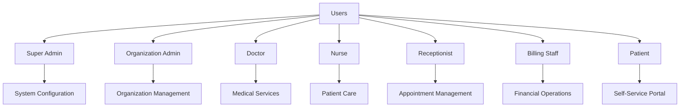
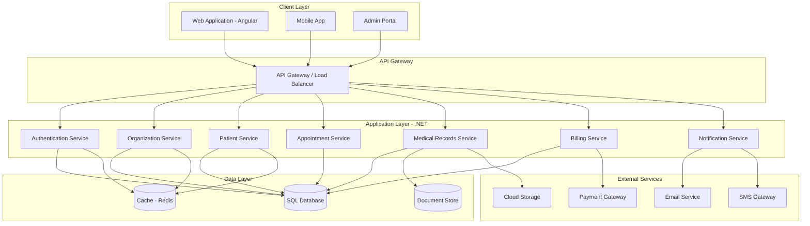
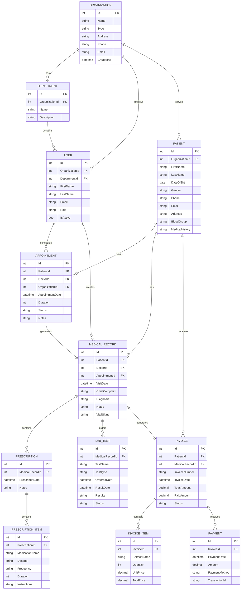
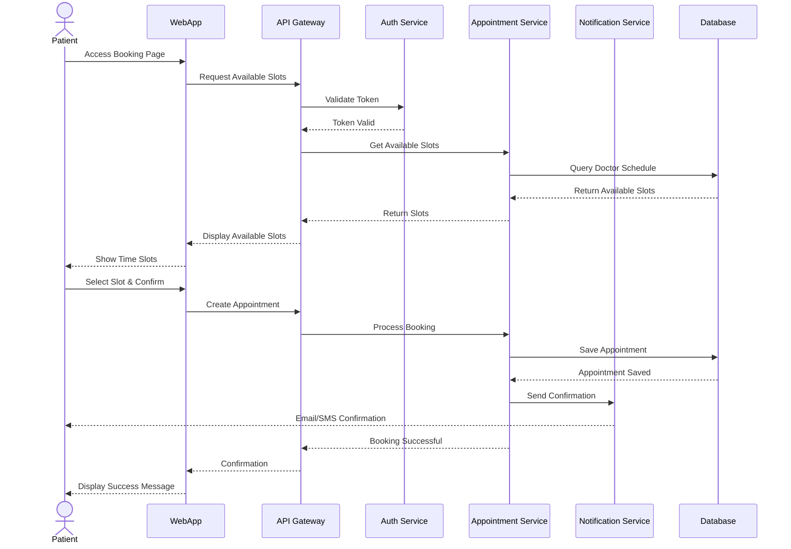
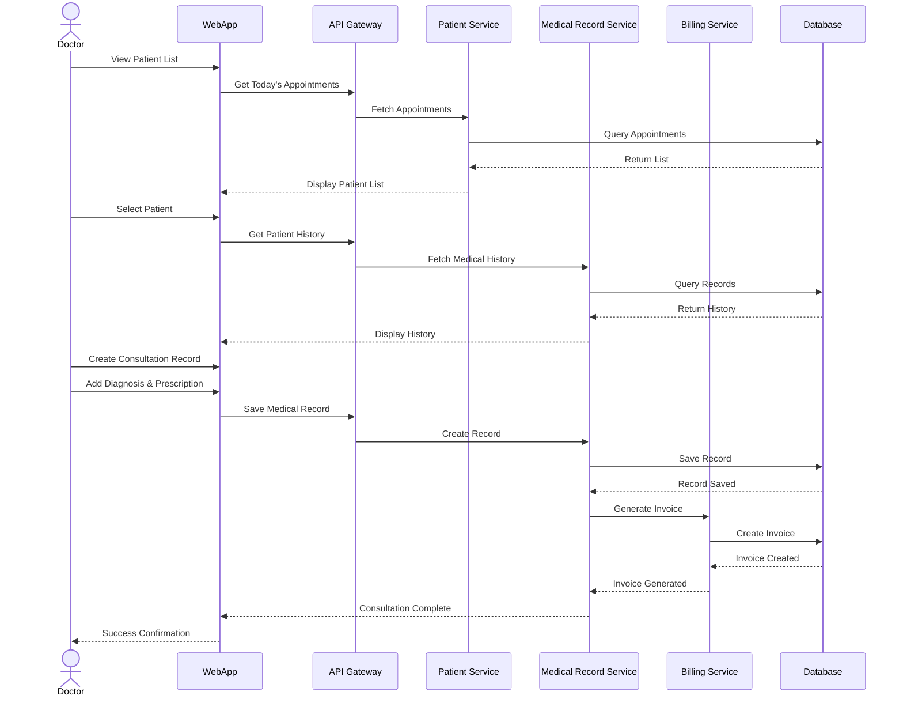
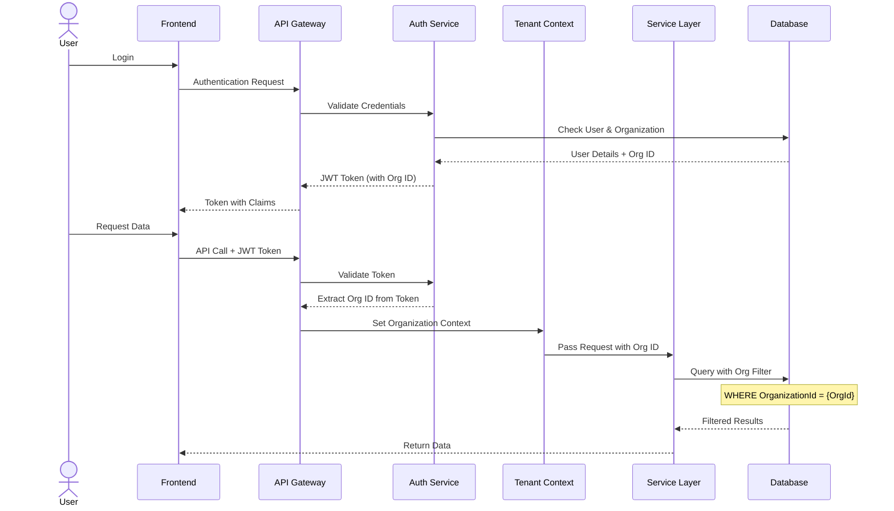
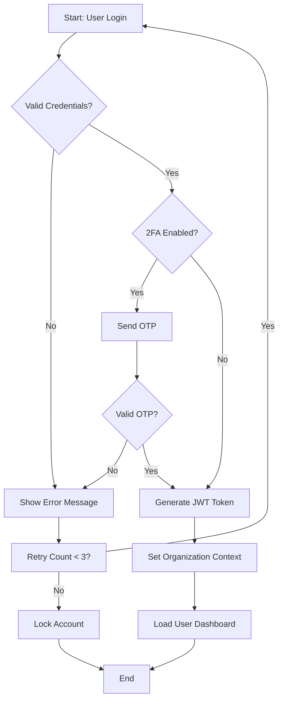
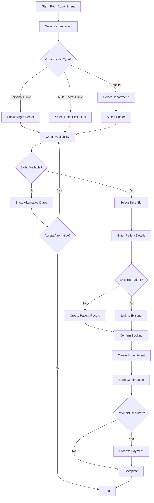
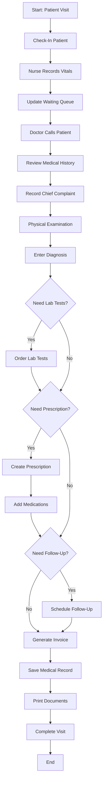
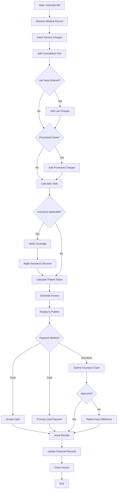

# Medical Management System - System Design Document

## 1. System Overview

### 1.1 Purpose
The Medical Management System is a comprehensive healthcare platform designed to serve three distinct operational models:
- **Personal Clinic**: Single doctor practice
- **Multi-Doctor Clinic**: Clinic with multiple doctors
- **Hospital**: Large facility with multiple departments and doctors

### 1.2 Scope
The system manages patient records, appointments, medical history, prescriptions, billing, and reporting across different organizational structures while maintaining data privacy and security compliance.

### 1.3 Key Features
- Patient registration and management
- Appointment scheduling
- Electronic Medical Records (EMR)
- Prescription management
- Billing and invoicing
- Reporting and analytics
- Multi-tenant architecture
- Role-based access control

---

## 2. Stakeholders & User Types

### 2.1 Primary Stakeholders
- **Healthcare Providers**: Doctors, Nurses, Medical Staff
- **Patients**: Individuals seeking medical care
- **Administrative Staff**: Receptionists, Billing personnel
- **System Administrators**: IT staff managing the platform

### 2.2 User Roles



### 2.3 Role Permissions

| Role | Permissions |
|------|-------------|
| Super Admin | Full system access, multi-tenant management |
| Organization Admin | Organization settings, user management, reporting |
| Doctor | Patient records, prescriptions, appointments, medical history |
| Nurse | Patient vitals, basic records, assist doctor |
| Receptionist | Appointments, patient registration, basic info |
| Billing Staff | Invoicing, payments, financial reports |
| Patient | View own records, book appointments, view prescriptions |

---

## 3. Functional Requirements

### 3.1 Organization Management
- **FR-ORG-001**: System shall support multiple organization types (Personal Clinic, Multi-Doctor Clinic, Hospital)
- **FR-ORG-002**: Each organization shall have configurable settings (working hours, departments, services)
- **FR-ORG-003**: Hospital type shall support department hierarchy
- **FR-ORG-004**: System shall allow organization-specific branding

### 3.2 User Management
- **FR-USER-001**: System shall support role-based access control
- **FR-USER-002**: Users shall be assigned to specific organizations
- **FR-USER-003**: Doctors can work across multiple organizations
- **FR-USER-004**: Authentication shall support SSO and 2FA

### 3.3 Patient Management
- **FR-PAT-001**: Register new patients with complete demographics
- **FR-PAT-002**: Maintain comprehensive medical history
- **FR-PAT-003**: Support patient search and filtering
- **FR-PAT-004**: Track patient visits and encounters
- **FR-PAT-005**: Manage patient documents and files

### 3.4 Appointment Management
- **FR-APT-001**: Schedule appointments with specific doctors
- **FR-APT-002**: Support recurring appointments
- **FR-APT-003**: Send automated reminders (SMS/Email)
- **FR-APT-004**: Handle appointment cancellations and rescheduling
- **FR-APT-005**: Show doctor availability calendar

### 3.5 Medical Records
- **FR-MED-001**: Create and update medical records per visit
- **FR-MED-002**: Record diagnosis using ICD-10 codes
- **FR-MED-003**: Create electronic prescriptions
- **FR-MED-004**: Track vital signs and lab results
- **FR-MED-005**: Support medical imaging integration

### 3.6 Billing & Invoicing
- **FR-BILL-001**: Generate invoices for services rendered
- **FR-BILL-002**: Support multiple payment methods
- **FR-BILL-003**: Track insurance claims
- **FR-BILL-004**: Generate financial reports
- **FR-BILL-005**: Handle partial payments and refunds

---

## 4. Non-Functional Requirements

### 4.1 Performance
- **NFR-PERF-001**: System shall support 1000+ concurrent users
- **NFR-PERF-002**: Page load time shall be < 2 seconds
- **NFR-PERF-003**: API response time shall be < 500ms for 95% of requests

### 4.2 Security
- **NFR-SEC-001**: All data shall be encrypted at rest and in transit (TLS 1.3)
- **NFR-SEC-002**: Comply with HIPAA/GDPR regulations
- **NFR-SEC-003**: Implement audit logging for all data access
- **NFR-SEC-004**: Support data isolation between organizations

### 4.3 Scalability
- **NFR-SCALE-001**: Horizontal scaling capability
- **NFR-SCALE-002**: Support 100+ organizations
- **NFR-SCALE-003**: Database partitioning by organization

### 4.4 Availability
- **NFR-AVAIL-001**: System uptime of 99.9%
- **NFR-AVAIL-002**: Automated backup every 6 hours
- **NFR-AVAIL-003**: Disaster recovery plan with RPO < 1 hour

### 4.5 Usability
- **NFR-USE-001**: Responsive design for desktop, tablet, and mobile
- **NFR-USE-002**: Support multiple languages
- **NFR-USE-003**: Accessibility compliance (WCAG 2.1 Level AA)

---

## 5. User Scenarios

### 5.1 Scenario: Patient Booking Appointment

**Actor**: Patient
**Goal**: Book an appointment with a doctor

**Steps**:
1. Patient logs into the system
2. Selects desired clinic/hospital
3. Chooses specialty or specific doctor
4. Views available time slots
5. Selects preferred date and time
6. Confirms appointment
7. Receives confirmation via email/SMS

### 5.2 Scenario: Doctor Consultation

**Actor**: Doctor
**Goal**: Complete a patient consultation

**Steps**:
1. Doctor views daily appointment schedule
2. Calls patient from waiting room
3. Reviews patient medical history
4. Records vitals (delegated to nurse)
5. Documents symptoms and examination
6. Creates diagnosis
7. Prescribes medications
8. Orders lab tests if needed
9. Schedules follow-up appointment
10. Completes visit documentation

### 5.3 Scenario: Billing Process

**Actor**: Billing Staff
**Goal**: Generate and process invoice

**Steps**:
1. Views completed consultations
2. Generates invoice with service charges
3. Applies insurance coverage if applicable
4. Presents invoice to patient
5. Processes payment
6. Issues receipt
7. Updates financial records

---

## 6. High-Level Design (HLD)

### 6.1 System Architecture



---

## 7. Entity Relationship Diagrams (ERD)

### 7.1 Core ERD



---

## 8. Sequence Diagrams

### 8.1 Patient Appointment Booking Flow



### 8.2 Doctor Consultation Flow



### 8.3 Multi-Tenant Data Access Flow



---

## 9. Flow Charts

### 9.1 User Authentication Flow



### 9.2 Appointment Booking Flow



### 9.3 Medical Record Creation Flow



### 9.4 Billing Process Flow



---

## 10. Technical Implementation Details

### 10.1 Technology Stack

#### Frontend (Angular)
- **Framework**: Angular 17+
- **State Management**: NgRx or Akita
- **UI Framework**: Angular Material or PrimeNG
- **HTTP Client**: Angular HttpClient with Interceptors
- **Authentication**: JWT with HTTP Interceptors
- **Routing**: Angular Router with Guards
- **Forms**: Reactive Forms with Validation

#### Backend (.NET)
- **Framework**: ASP.NET Core 8.0 Web API
- **Architecture**: Clean Architecture / Onion Architecture
- **ORM**: Entity Framework Core 8.0
- **Database**: SQL Server 2022 / PostgreSQL
- **Caching**: Redis
- **Authentication**: JWT Bearer Token with IdentityServer or Auth0
- **API Documentation**: Swagger/OpenAPI
- **Logging**: Serilog
- **Mapping**: AutoMapper

### 10.2 Database Schema (SQL Server)

```sql
-- Organization Table
CREATE TABLE Organizations (
    Id INT PRIMARY KEY IDENTITY(1,1),
    Name NVARCHAR(200) NOT NULL,
    Type NVARCHAR(50) NOT NULL CHECK (Type IN ('PersonalClinic', 'MultiDoctorClinic', 'Hospital')),
    Address NVARCHAR(500),
    Phone NVARCHAR(20),
    Email NVARCHAR(100),
    CreatedAt DATETIME2 DEFAULT GETUTCDATE(),
    UpdatedAt DATETIME2 DEFAULT GETUTCDATE(),
    IsActive BIT DEFAULT 1
);

-- Users Table
CREATE TABLE Users (
    Id INT PRIMARY KEY IDENTITY(1,1),
    OrganizationId INT NOT NULL FOREIGN KEY REFERENCES Organizations(Id),
    DepartmentId INT NULL FOREIGN KEY REFERENCES Departments(Id),
    FirstName NVARCHAR(100) NOT NULL,
    LastName NVARCHAR(100) NOT NULL,
    Email NVARCHAR(100) UNIQUE NOT NULL,
    PasswordHash NVARCHAR(255) NOT NULL,
    Role NVARCHAR(50) NOT NULL,
    Phone NVARCHAR(20),
    CreatedAt DATETIME2 DEFAULT GETUTCDATE(),
    IsActive BIT DEFAULT 1,
    INDEX IX_Users_OrganizationId (OrganizationId),
    INDEX IX_Users_Email (Email)
);

-- Patients Table
CREATE TABLE Patients (
    Id INT PRIMARY KEY IDENTITY(1,1),
    OrganizationId INT NOT NULL FOREIGN KEY REFERENCES Organizations(Id),
    FirstName NVARCHAR(100) NOT NULL,
    LastName NVARCHAR(100) NOT NULL,
    DateOfBirth DATE NOT NULL,
    Gender NVARCHAR(10),
    Phone NVARCHAR(20),
    Email NVARCHAR(100),
    Address NVARCHAR(500),
    BloodGroup NVARCHAR(10),
    EmergencyContact NVARCHAR(200),
    CreatedAt DATETIME2 DEFAULT GETUTCDATE(),
    UpdatedAt DATETIME2 DEFAULT GETUTCDATE(),
    INDEX IX_Patients_OrganizationId (OrganizationId),
    INDEX IX_Patients_Email (Email)
);

-- Appointments Table
CREATE TABLE Appointments (
    Id INT PRIMARY KEY IDENTITY(1,1),
    PatientId INT NOT NULL FOREIGN KEY REFERENCES Patients(Id),
    DoctorId INT NOT NULL FOREIGN KEY REFERENCES Users(Id),
    OrganizationId INT NOT NULL FOREIGN KEY REFERENCES Organizations(Id),
    AppointmentDate DATETIME2 NOT NULL,
    Duration INT DEFAULT 30,
    Status NVARCHAR(50) DEFAULT 'Scheduled',
    Notes NVARCHAR(1000),
    CreatedAt DATETIME2 DEFAULT GETUTCDATE(),
    INDEX IX_Appointments_Date (AppointmentDate),
    INDEX IX_Appointments_Doctor (DoctorId, AppointmentDate),
    INDEX IX_Appointments_Patient (PatientId)
);
```

### 10.3 .NET Project Structure

```
MedicalSystem.Solution/
│
├── MedicalSystem.API/                    # Web API Project
│   ├── Controllers/
│   ├── Middleware/
│   ├── Filters/
│   └── Program.cs
│
├── MedicalSystem.Application/            # Business Logic
│   ├── Services/
│   │   ├── PatientService.cs
│   │   ├── AppointmentService.cs
│   │   └── MedicalRecordService.cs
│   ├── DTOs/
│   ├── Interfaces/
│   └── Validators/
│
├── MedicalSystem.Domain/                 # Domain Models
│   ├── Entities/
│   │   ├── Organization.cs
│   │   ├── Patient.cs
│   │   ├── Appointment.cs
│   │   └── MedicalRecord.cs
│   ├── Enums/
│   └── ValueObjects/
│
├── MedicalSystem.Infrastructure/         # Data Access
│   ├── Data/
│   │   ├── ApplicationDbContext.cs
│   │   └── Configurations/
│   ├── Repositories/
│   ├── Migrations/
│   └── Services/
│
└── MedicalSystem.Shared/                 # Shared Resources
    ├── Constants/
    ├── Exceptions/
    └── Helpers/
```

### 10.4 Angular Project Structure

```
medical-system-app/
│
├── src/
│   ├── app/
│   │   ├── core/                        # Singleton Services
│   │   │   ├── services/
│   │   │   │   ├── auth.service.ts
│   │   │   │   └── api.service.ts
│   │   │   ├── guards/
│   │   │   ├── interceptors/
│   │   │   └── models/
│   │   │
│   │   ├── shared/                      # Shared Components
│   │   │   ├── components/
│   │   │   ├── directives/
│   │   │   └── pipes/
│   │   │
│   │   ├── features/                    # Feature Modules
│   │   │   ├── patients/
│   │   │   │   ├── patient-list/
│   │   │   │   ├── patient-detail/
│   │   │   │   └── patients.module.ts
│   │   │   ├── appointments/
│   │   │   ├── medical-records/
│   │   │   └── billing/
│   │   │
│   │   ├── layout/                      # Layout Components
│   │   │   ├── header/
│   │   │   ├── sidebar/
│   │   │   └── footer/
│   │   │
│   │   └── app-routing.module.ts
│   │
│   └── environments/
```

### 10.5 Key API Endpoints

```
Authentication:
POST   /api/auth/login
POST   /api/auth/register
POST   /api/auth/refresh-token
POST   /api/auth/logout

Organizations:
GET    /api/organizations
GET    /api/organizations/{id}
POST   /api/organizations
PUT    /api/organizations/{id}

Patients:
GET    /api/patients
GET    /api/patients/{id}
POST   /api/patients
PUT    /api/patients/{id}
GET    /api/patients/{id}/history

Appointments:
GET    /api/appointments
GET    /api/appointments/{id}
POST   /api/appointments
PUT    /api/appointments/{id}
DELETE /api/appointments/{id}
GET    /api/appointments/available-slots

Medical Records:
GET    /api/medical-records/{patientId}
POST   /api/medical-records
GET    /api/medical-records/{id}
PUT    /api/medical-records/{id}

Prescriptions:
GET    /api/prescriptions/{medicalRecordId}
POST   /api/prescriptions

Billing:
GET    /api/invoices
GET    /api/invoices/{id}
POST   /api/invoices
POST   /api/payments
```

### 10.6 Multi-Tenancy Implementation

```csharp
// Tenant Context Service
public class TenantContext
{
    public int OrganizationId { get; set; }
    public string OrganizationType { get; set; }
}

// Middleware to Extract Tenant
public class TenantMiddleware
{
    private readonly RequestDelegate _next;
    
    public async Task InvokeAsync(HttpContext context, TenantContext tenantContext)
    {
        var token = context.Request.Headers["Authorization"].ToString();
        var claims = ExtractClaimsFromToken(token);
        
        tenantContext.OrganizationId = int.Parse(claims["OrganizationId"]);
        tenantContext.OrganizationType = claims["OrganizationType"];
        
        await _next(context);
    }
}

// Global Query Filter in DbContext
protected override void OnModelCreating(ModelBuilder modelBuilder)
{
    modelBuilder.Entity<Patient>()
        .HasQueryFilter(p => p.OrganizationId == _tenantContext.OrganizationId);
    
    modelBuilder.Entity<Appointment>()
        .HasQueryFilter(a => a.OrganizationId == _tenantContext.OrganizationId);
}
```

### 10.7 Security Implementation

```typescript
// Angular HTTP Interceptor
@Injectable()
export class AuthInterceptor implements HttpInterceptor {
  intercept(req: HttpRequest<any>, next: HttpHandler): Observable<HttpEvent<any>> {
    const token = this.authService.getToken();
    
    if (token) {
      req = req.clone({
        setHeaders: {
          Authorization: `Bearer ${token}`,
          'X-Organization-Id': this.authService.getOrganizationId()
        }
      });
    }
    
    return next.handle(req);
  }
}
```

### 10.8 Caching Strategy

```csharp
// Redis Caching in .NET
public class CacheService : ICacheService
{
    private readonly IDistributedCache _cache;
    
    public async Task<T> GetOrSetAsync<T>(
        string key, 
        Func
