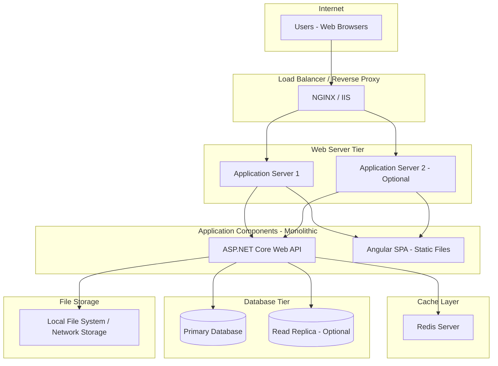

# Medical Management System - System Design Document

## Table of Contents
1. [System Overview](#1-system-overview)
2. [Stakeholders & User Types](#2-stakeholders--user-types)
3. [Functional Requirements](#3-functional-requirements)
4. [Non-Functional Requirements](#4-non-functional-requirements)
5. [User Scenarios](#5-user-scenarios)
6. [High-Level Design (HLD)](#6-high-level-design-hld)
7. [Entity Relationship Diagrams (ERD)](#7-entity-relationship-diagrams-erd)
8. [Sequence Diagrams](#8-sequence-diagrams)
9. [Flow Charts](#9-flow-charts)
10. [Technical Implementation Details](#10-technical-implementation-details)

---

## 1. System Overview

### 1.1 Purpose
The Medical Management System is a comprehensive healthcare platform designed to serve three distinct operational models with two deployment options:
- **Personal Clinic**: Single doctor practice
- **Multi-Doctor Clinic**: Clinic with multiple doctors
- **Hospital**: Large facility with multiple departments and doctors

### 1.2 Deployment Models
The system supports two deployment strategies:
1. **SaaS Multi-Tenant Model**: Centralized hosting with subscription-based access managed by Super Admin
2. **Private Deployment Model**: Self-hosted installation where clients receive source code for deployment on their private servers

### 1.3 Version Roadmap

#### Version 1.0 (Current Scope)
- Core patient management functionality
- Appointment scheduling (without SMS/Email notifications)
- Electronic Medical Records (EMR)
- Prescription management
- Basic billing and invoicing (cash/manual payments only)
- Multi-tenant architecture with manual entry
- Role-based access control
- Cost-optimized deployment (no external service integrations)

#### Version 2.0 (Future Scope)
- Mobile application (iOS & Android)
- Automated SMS notifications
- Email notifications and reminders
- Automated payment gateway integration
- Advanced reporting and analytics
- Lab integration
- Pharmacy integration
- Insurance claim management
- Telemedicine capabilities

### 1.4 Key Features (Version 1.0)
- Patient registration and management
- Manual appointment scheduling
- Electronic Medical Records (EMR)
- Prescription management
- Manual billing and invoicing
- Basic reporting
- Multi-tenant architecture
- Role-based access control
- Manual data entry for all operations

### 1.5 Architectural Approach
- **Architecture Pattern**: Clean Architecture (Onion Architecture)
- **Deployment Style**: Monolithic application
- **Data Mapping**: Manual mapping (no AutoMapper)
- **Validation**: FluentValidation
- **Database**: Single database with tenant isolation via OrganizationId
- **Caching**: Redis for performance optimization

---

## 2. Stakeholders & User Types

### 2.1 Primary Stakeholders

#### Healthcare Providers
- Doctors providing medical consultations
- Nurses assisting with patient care
- Medical staff managing day-to-day operations

#### Patients
- Individuals seeking medical care
- Can be registered by receptionist or self-register (if enabled)

#### Administrative Staff
- Receptionists managing appointments and patient registration
- Billing personnel handling invoices and payments
- Organization administrators managing clinic/hospital settings

#### System Stakeholders
- **Super Admin**: Platform owner managing multi-tenant SaaS deployments
- **IT Staff**: Technical teams managing private deployments
- **Clients**: Healthcare organizations subscribing to or purchasing the system

### 2.2 User Roles Hierarchy


### 2.3 Role Permissions Matrix

| Role | Patient Management | Appointments | Medical Records | Prescriptions | Billing | User Management | System Config | Organization Config |
|------|-------------------|--------------|-----------------|---------------|---------|-----------------|---------------|---------------------|
| **Super Admin** | ✓ (All Orgs) | ✓ (All Orgs) | ✓ (All Orgs) | ✓ (All Orgs) | ✓ (All Orgs) | ✓ (All Orgs) | ✓ | ✓ (All Orgs) |
| **Organization Admin** | ✓ (Own Org) | ✓ (Own Org) | ✓ (View Only) | ✓ (View Only) | ✓ (Own Org) | ✓ (Own Org) | ✗ | ✓ (Own Org) |
| **Doctor** | ✓ (Read) | ✓ (View/Update) | ✓ (Create/Edit) | ✓ (Create/Edit) | ✗ | ✗ | ✗ | ✗ |
| **Nurse** | ✓ (Read) | ✓ (View) | ✓ (Vitals Only) | ✗ | ✗ | ✗ | ✗ | ✗ |
| **Receptionist** | ✓ (Create/Edit) | ✓ (Create/Edit) | ✗ | ✗ | ✗ | ✗ | ✗ | ✗ |
| **Billing Staff** | ✓ (Read) | ✓ (Read) | ✓ (Read) | ✓ (Read) | ✓ (All) | ✗ | ✗ | ✗ |
| **Patient** | ✓ (Own Only) | ✓ (View Own) | ✓ (View Own) | ✓ (View Own) | ✓ (View Own) | ✗ | ✗ | ✗ |

### 2.4 Deployment-Specific Roles

#### SaaS Multi-Tenant Deployment
- **Super Admin**: Manages all organizations, subscriptions, and system-wide settings
- **Organization Admin**: Manages their specific organization
- **Regular Users**: Work within their assigned organization

#### Private Deployment
- **No Super Admin**: Organization Admin has full system control
- **Organization Admin**: Acts as system administrator
- **Regular Users**: Same as multi-tenant model

---

## 3. Functional Requirements

### 3.1 Deployment & Multi-Tenancy Management

#### FR-DEPLOY-001: Dual Deployment Support
**Description**: System shall support both SaaS multi-tenant and private deployment models  
**Priority**: Critical  
**Details**:
- Single codebase supporting both deployment types
- Configuration-based switching between deployment modes
- Tenant isolation maintained in both models

#### FR-DEPLOY-002: SaaS Subscription Management
**Description**: Super Admin shall manually manage organization subscriptions  
**Priority**: High (SaaS only)  
**Details**:
- Manual creation of organization accounts
- Manual subscription activation/deactivation
- Manual user limit configuration per organization
- No automated payment processing in Version 1.0

#### FR-DEPLOY-003: Private Deployment Configuration
**Description**: System shall support standalone private deployment  
**Priority**: Critical  
**Details**:
- Single organization mode
- No Super Admin role in private deployment
- Organization Admin has system-level access
- No subscription management features visible

### 3.2 Organization Management

#### FR-ORG-001: Organization Type Support
**Description**: System shall support three organization types  
**Priority**: Critical  
**Details**:
- Personal Clinic: Single doctor, no departments
- Multi-Doctor Clinic: Multiple doctors, optional departments
- Hospital: Multiple departments, multiple doctors per department

#### FR-ORG-002: Organization Configuration
**Description**: Organization Admin shall configure organization settings  
**Priority**: High  
**Details**:
- Working hours and days
- Service offerings and pricing
- Branding (logo, colors, contact information)
- Appointment duration defaults

#### FR-ORG-003: Department Management
**Description**: Hospital-type organizations shall manage departments  
**Priority**: Medium  
**Details**:
- Create/edit/delete departments
- Assign doctors to departments
- Configure department-specific services
- Department hierarchy support

#### FR-ORG-004: Multi-Organization Doctor Assignment
**Description**: Doctors shall work across multiple organizations  
**Priority**: Medium  
**Details**:
- Doctor can be assigned to multiple organizations
- Separate schedules per organization
- Organization-specific permissions

### 3.3 User Management

#### FR-USER-001: Role-Based Access Control
**Description**: System shall implement comprehensive role-based permissions  
**Priority**: Critical  
**Details**:
- Seven distinct roles (Super Admin, Org Admin, Doctor, Nurse, Receptionist, Billing Staff, Patient)
- Permission matrix enforcement
- Role-based UI rendering

#### FR-USER-002: User Account Management
**Description**: Organization Admin shall manage user accounts  
**Priority**: High  
**Details**:
- Create/edit/deactivate user accounts
- Assign roles and permissions
- Reset passwords
- Set user-organization associations

#### FR-USER-003: User Authentication
**Description**: System shall provide secure authentication  
**Priority**: Critical  
**Details**:
- Email and password-based login
- JWT token-based session management
- Password strength requirements
- Account lockout after failed attempts
- Optional two-factor authentication (Version 2.0)

#### FR-USER-004: User Profile Management
**Description**: Users shall manage their profile information  
**Priority**: Medium  
**Details**:
- Update personal information
- Change password
- Set preferences
- Upload profile picture

### 3.4 Patient Management

#### FR-PAT-001: Patient Registration
**Description**: Receptionists shall register new patients  
**Priority**: Critical  
**Details**:
- Capture complete demographics (name, DOB, gender, contact)
- Assign unique patient ID
- Record emergency contact information
- Capture blood group and allergies
- Optional patient photo

#### FR-PAT-002: Patient Search and Retrieval
**Description**: System shall provide efficient patient search  
**Priority**: High  
**Details**:
- Search by name, phone, email, patient ID
- Filter by registration date, age, gender
- Quick search with autocomplete
- Recent patients list

#### FR-PAT-003: Patient History Management
**Description**: System shall maintain comprehensive patient history  
**Priority**: Critical  
**Details**:
- Complete visit history
- Chronological medical records
- Prescription history
- Lab test history (manual entry)
- Billing history

#### FR-PAT-004: Patient Demographics Update
**Description**: Authorized users shall update patient information  
**Priority**: Medium  
**Details**:
- Edit contact information
- Update address and emergency contacts
- Modify medical history
- Audit trail of changes

#### FR-PAT-005: Patient Document Management
**Description**: System shall store patient-related documents  
**Priority**: Medium  
**Details**:
- Upload medical reports
- Store lab results (PDF/Image)
- Attach prescriptions
- Archive consent forms

### 3.5 Appointment Management

#### FR-APT-001: Manual Appointment Scheduling
**Description**: Receptionists shall manually schedule appointments  
**Priority**: Critical  
**Details**:
- Select patient (existing or register new)
- Choose doctor and date/time
- Set appointment duration
- Add appointment notes
- Confirm booking (no automated notifications in V1.0)

#### FR-APT-002: Doctor Schedule Management
**Description**: System shall manage doctor availability  
**Priority**: High  
**Details**:
- Define working hours per doctor
- Set availability by day of week
- Block time slots for breaks/meetings
- Mark unavailable dates (leaves/holidays)

#### FR-APT-003: Appointment Calendar View
**Description**: Users shall view appointments in calendar format  
**Priority**: High  
**Details**:
- Daily, weekly, monthly views
- Doctor-specific calendars
- Color-coded appointment status
- Quick appointment details on hover

#### FR-APT-004: Appointment Status Management
**Description**: System shall track appointment lifecycle  
**Priority**: Medium  
**Details**:
- Status: Scheduled, Confirmed, In Progress, Completed, Cancelled, No-Show
- Manual status updates
- Cancellation with reason
- Rescheduling capability

#### FR-APT-005: Walk-in Patient Handling
**Description**: System shall support walk-in appointments  
**Priority**: Medium  
**Details**:
- Quick appointment registration
- Add to waiting queue
- Prioritization options
- Immediate consultation flow

### 3.6 Medical Records Management

#### FR-MED-001: Consultation Record Creation
**Description**: Doctors shall create medical records per visit  
**Priority**: Critical  
**Details**:
- Chief complaint entry
- Symptoms documentation
- Physical examination findings
- Diagnosis with ICD-10 code support
- Treatment plan
- Doctor notes

#### FR-MED-002: Vital Signs Recording
**Description**: Nurses shall record patient vital signs  
**Priority**: High  
**Details**:
- Blood pressure, pulse, temperature
- Height, weight, BMI calculation
- Respiratory rate, oxygen saturation
- Timestamp and recorded by information

#### FR-MED-003: Medical History Access
**Description**: Doctors shall access complete patient medical history  
**Priority**: Critical  
**Details**:
- Chronological visit records
- Previous diagnoses
- Ongoing treatments
- Allergy information
- Family medical history

#### FR-MED-004: Medical Record Search
**Description**: System shall enable searching medical records  
**Priority**: Medium  
**Details**:
- Search by diagnosis
- Filter by date range
- Search by doctor
- Filter by ICD-10 codes

#### FR-MED-005: Medical Record Editing
**Description**: Doctors shall edit their own medical records  
**Priority**: Medium  
**Details**:
- Edit within 24 hours of creation
- Add addendum to older records
- Full audit trail of changes
- Cannot delete records

### 3.7 Prescription Management

#### FR-PRESC-001: Electronic Prescription Creation
**Description**: Doctors shall create electronic prescriptions  
**Priority**: Critical  
**Details**:
- Add multiple medications
- Specify dosage and frequency
- Set duration of treatment
- Add special instructions
- Link to medical record

#### FR-PRESC-002: Medication Database
**Description**: System shall maintain medication master list  
**Priority**: High  
**Details**:
- Searchable medication database
- Generic and brand names
- Standard dosages
- Drug interaction warnings (basic)
- Frequently prescribed medications

#### FR-PRESC-003: Prescription Templates
**Description**: Doctors shall create and use prescription templates  
**Priority**: Medium  
**Details**:
- Save common prescriptions
- Quick template selection
- Modify template before finalizing
- Personal template library

#### FR-PRESC-004: Prescription Printing
**Description**: System shall generate printable prescriptions  
**Priority**: High  
**Details**:
- Professional prescription format
- Doctor and clinic details
- Patient information
- QR code for verification (optional)
- Prescription number

#### FR-PRESC-005: Prescription History
**Description**: System shall maintain prescription history  
**Priority**: Medium  
**Details**:
- View all patient prescriptions
- Reprint previous prescriptions
- Track refills manually
- Search by medication name

### 3.8 Laboratory Test Management (Manual Entry)

#### FR-LAB-001: Lab Test Ordering
**Description**: Doctors shall order laboratory tests  
**Priority**: Medium  
**Details**:
- Select from test catalog
- Add clinical notes
- Mark as urgent if needed
- Generate lab request form

#### FR-LAB-002: Lab Test Catalog
**Description**: System shall maintain lab test master list  
**Priority**: Medium  
**Details**:
- Searchable test catalog
- Test descriptions
- Sample types
- Normal ranges

#### FR-LAB-003: Manual Lab Results Entry
**Description**: Staff shall manually enter lab results  
**Priority**: Medium  
**Details**:
- Enter test results manually
- Attach PDF/image reports
- Mark abnormal values
- Add lab technician notes

#### FR-LAB-004: Lab Results Viewing
**Description**: Doctors and patients shall view lab results  
**Priority**: Medium  
**Details**:
- Display results with normal ranges
- Highlight abnormal values
- View historical trends
- Compare with previous results

### 3.9 Billing & Invoicing (Manual Payment Only)

#### FR-BILL-001: Manual Invoice Generation
**Description**: Billing staff shall manually create invoices  
**Priority**: Critical  
**Details**:
- Link to medical record/appointment
- Add consultation charges
- Add procedure charges
- Add lab test charges (manual)
- Add medication charges (if applicable)
- Calculate total amount

#### FR-BILL-002: Service Pricing Management
**Description**: Organization Admin shall configure service pricing  
**Priority**: High  
**Details**:
- Set consultation fees by doctor
- Configure procedure pricing
- Set lab test prices
- Define medication pricing (optional)

#### FR-BILL-003: Manual Payment Recording
**Description**: Billing staff shall record payments manually  
**Priority**: Critical  
**Details**:
- Record cash payments
- Record card payments (manual entry)
- Record check payments
- Enter payment reference number
- Generate payment receipt

#### FR-BILL-004: Partial Payment Support
**Description**: System shall handle partial payments  
**Priority**: Medium  
**Details**:
- Record partial amount
- Track outstanding balance
- Multiple payment entries per invoice
- Payment history per invoice

#### FR-BILL-005: Invoice Management
**Description**: System shall manage invoice lifecycle  
**Priority**: High  
**Details**:
- Status: Draft, Issued, Partially Paid, Paid, Cancelled
- Invoice search and filtering
- Reprint invoices
- Credit note generation
- Invoice voiding with reason

#### FR-BILL-006: Receipt Generation
**Description**: System shall generate payment receipts  
**Priority**: High  
**Details**:
- Professional receipt format
- Organization details
- Payment details
- Outstanding balance (if any)
- Receipt number

### 3.10 Reporting & Analytics

#### FR-REP-001: Patient Reports
**Description**: System shall generate patient-related reports  
**Priority**: Medium  
**Details**:
- Patient registration report
- Patient visit summary
- Demographics analysis
- New vs returning patients

#### FR-REP-002: Appointment Reports
**Description**: System shall generate appointment reports  
**Priority**: Medium  
**Details**:
- Daily appointment schedule
- Doctor utilization report
- Appointment status summary
- No-show analysis

#### FR-REP-003: Financial Reports
**Description**: System shall generate financial reports  
**Priority**: High  
**Details**:
- Daily collection report
- Revenue by service type
- Revenue by doctor
- Outstanding payments report
- Monthly financial summary

#### FR-REP-004: Doctor Performance Reports
**Description**: System shall track doctor metrics  
**Priority**: Low  
**Details**:
- Consultation count
- Revenue generated
- Average consultation time
- Patient satisfaction (if implemented)

#### FR-REP-005: Report Export
**Description**: Users shall export reports  
**Priority**: Medium  
**Details**:
- Export to PDF
- Export to Excel
- Print functionality
- Email report (Version 2.0)

---

## 4. Non-Functional Requirements

### 4.1 Performance Requirements

#### NFR-PERF-001: Response Time
**Description**: System shall respond quickly to user actions  
**Target**:
- Page load time: < 2 seconds
- API response time: < 500ms for 95% of requests
- Search operations: < 1 second
- Report generation: < 5 seconds for standard reports

#### NFR-PERF-002: Concurrent Users
**Description**: System shall support multiple simultaneous users  
**Target**:
- Support 100+ concurrent users per organization
- Support 1000+ concurrent users across all tenants (SaaS)
- No performance degradation up to target load

#### NFR-PERF-003: Database Performance
**Description**: Database operations shall be optimized  
**Target**:
- Query execution: < 200ms for standard queries
- Indexed searches: < 100ms
- Transaction commit: < 100ms

#### NFR-PERF-004: Caching Strategy
**Description**: System shall implement efficient caching  
**Target**:
- Redis cache for frequently accessed data
- Cache hit ratio: > 80% for static data
- Cache invalidation strategy in place

### 4.2 Security Requirements

#### NFR-SEC-001: Data Encryption
**Description**: All sensitive data shall be encrypted  
**Implementation**:
- Data at rest: Database encryption
- Data in transit: TLS 1.3
- Password storage: Bcrypt/PBKDF2 hashing
- Sensitive fields: Application-level encryption

#### NFR-SEC-002: Authentication & Authorization
**Description**: Secure access control mechanisms  
**Implementation**:
- JWT-based authentication
- Token expiration: 1 hour
- Refresh token support
- Role-based authorization
- Organization-based data isolation

#### NFR-SEC-003: HIPAA Compliance (Where Applicable)
**Description**: System shall follow healthcare data protection standards  
**Implementation**:
- Audit logging of all data access
- Patient consent management
- Data access restrictions
- Secure data disposal procedures

#### NFR-SEC-004: Multi-Tenant Data Isolation
**Description**: Complete data segregation between organizations  
**Implementation**:
- Organization ID in all database queries
- Query filters at database context level
- No cross-tenant data leakage
- Separate data backups per tenant (optional)

#### NFR-SEC-005: Security Audit Trail
**Description**: Complete audit logging for security events  
**Implementation**:
- Log all authentication attempts
- Log all data modifications
- Log all access to sensitive data
- User action tracking with timestamps
- IP address and device logging

### 4.3 Scalability Requirements

#### NFR-SCALE-001: Horizontal Scalability
**Description**: System architecture shall support horizontal scaling  
**Implementation**:
- Stateless application design
- Load balancing support
- Distributed caching with Redis
- Database connection pooling

#### NFR-SCALE-002: Database Scalability
**Description**: Database shall scale with growing data  
**Implementation**:
- Indexed columns for fast queries
- Partitioning strategy for large tables
- Archive old data strategy
- Read replicas for reporting (optional)

#### NFR-SCALE-003: Organization Limit
**Description**: System shall support multiple organizations  
**Target**:
- Version 1.0: Support 100+ organizations (SaaS)
- Version 1.0: Unlimited patients per organization
- Version 1.0: 1000+ appointments per day per organization

#### NFR-SCALE-004: Data Growth Management
**Description**: System shall handle data growth efficiently  
**Implementation**:
- Pagination for all list views
- Lazy loading for large datasets
- Data archival policies
- Storage optimization strategies

### 4.4 Availability & Reliability

#### NFR-AVAIL-001: System Uptime
**Description**: System shall maintain high availability  
**Target**:
- Uptime: 99.5% (SaaS deployment)
- Planned downtime: < 4 hours per month
- Off-peak maintenance windows

#### NFR-AVAIL-002: Backup & Recovery
**Description**: Regular data backups and recovery procedures  
**Implementation**:
- Automated daily backups
- Point-in-time recovery capability
- Backup retention: 30 days
- Backup verification procedures
- Recovery Time Objective (RTO): < 4 hours
- Recovery Point Objective (RPO): < 24 hours

#### NFR-AVAIL-003: Error Handling
**Description**: Graceful error handling and recovery  
**Implementation**:
- User-friendly error messages
- Detailed error logging
- Automatic error reporting
- Transaction rollback on failures

#### NFR-AVAIL-004: Data Integrity
**Description**: Maintain data consistency and integrity  
**Implementation**:
- Database constraints and foreign keys
- Transaction management
- Validation at all layers
- Referential integrity enforcement

### 4.5 Usability Requirements

#### NFR-USE-001: User Interface Design
**Description**: Intuitive and user-friendly interface  
**Implementation**:
- Responsive design (desktop, tablet)
- Consistent UI patterns
- Material Design principles (Angular Material)
- Maximum 3 clicks to common functions

#### NFR-USE-002: Accessibility
**Description**: System shall be accessible to users with disabilities  
**Implementation**:
- WCAG 2.1 Level AA compliance (where possible)
- Keyboard navigation support
- Screen reader compatibility
- High contrast mode support
- Minimum font size: 14px

#### NFR-USE-003: Multi-Language Support
**Description**: Support multiple languages (Version 2.0)  
**Implementation**:
- i18n framework integration
- RTL language support
- Language selection per user
- Default: English

#### NFR-USE-004: Help & Documentation
**Description**: Comprehensive user guidance  
**Implementation**:
- In-app help tooltips
- User manual (PDF)
- Video tutorials (Version 2.0)
- Context-sensitive help

### 4.6 Maintainability Requirements

#### NFR-MAINT-001: Code Quality
**Description**: High-quality, maintainable codebase  
**Implementation**:
- Clean Architecture principles
- SOLID principles
- Comprehensive comments
- Consistent naming conventions
- Code review process

#### NFR-MAINT-002: Testing Requirements
**Description**: Comprehensive test coverage  
**Implementation**:
- Unit tests: > 70% coverage
- Integration tests for critical paths
- Manual testing checklist
- Regression testing procedures

#### NFR-MAINT-003: Logging & Monitoring
**Description**: Comprehensive system monitoring  
**Implementation**:
- Structured logging (Serilog)
- Application performance monitoring
- Error tracking and alerting
- Usage analytics
- Log retention: 90 days

#### NFR-MAINT-004: Configuration Management
**Description**: Flexible configuration without code changes  
**Implementation**:
- Environment-based configuration
- Feature flags for gradual rollouts
- Runtime configuration updates
- Separate dev/staging/production configs

### 4.7 Portability Requirements

#### NFR-PORT-001: Cross-Platform Support
**Description**: System shall run on multiple platforms  
**Implementation**:
- Backend: Windows Server, Linux
- Database: SQL Server, PostgreSQL
- Web browsers: Chrome, Firefox, Safari, Edge (latest 2 versions)
- No browser plugins required

#### NFR-PORT-002: Deployment Flexibility
**Description**: Easy deployment to different environments  
**Implementation**:
- Docker containerization support (optional)
- Cloud deployment ready (Azure, AWS)
- On-premise deployment support
- Minimal infrastructure requirements

### 4.8 Compliance Requirements

#### NFR-COMP-001: Healthcare Regulations
**Description**: Comply with healthcare industry standards  
**Implementation**:
- HIPAA compliance (US) - where applicable
- GDPR compliance (EU) - where applicable
- Local healthcare regulations
- Patient consent management
- Data privacy policies

#### NFR-COMP-002: Data Protection
**Description**: Protect patient and organizational data  
**Implementation**:
- Data minimization principles
- Right to be forgotten (soft delete)
- Data export capability
- Privacy policy enforcement
- Terms of service acceptance

### 4.9 Cost Optimization (Version 1.0)

#### NFR-COST-001: Minimal External Dependencies
**Description**: Reduce operational costs by avoiding paid services  
**Implementation**:
- No SMS gateway integration (V1.0)
- No email service integration (V1.0)
- No payment gateway integration (V1.0)
- No third-party APIs
- Self-hosted deployment options

#### NFR-COST-002: Resource Efficiency
**Description**: Optimize infrastructure costs  
**Implementation**:
- Efficient database queries
- Proper indexing strategy
- Redis caching to reduce DB load
- Minimal server requirements
- Single-server deployment capable

---

## 5. User Scenarios

### 5.1 Super Admin Scenarios (SaaS Deployment Only)

#### Scenario 5.1.1: Creating New Organization Account

**Actor**: Super Admin  
**Precondition**: Super Admin is logged into the system  
**Goal**: Manually create a new organization subscription

**Main Flow**:
1. Super Admin navigates to Organizations management section
2. Clicks "Add New Organization" button
3. Fills in organization details:
   - Organization name
   - Organization type (Personal Clinic / Multi-Doctor Clinic / Hospital)
   - Contact information (address, phone, email)
   - Primary contact person details
4. Sets organization configuration:
   - User limit (number of staff accounts)
   - Storage limit
   - Features enabled
   - Subscription start date
   - Subscription end date (if applicable)
5. Creates initial Organization Admin account:
   - Admin full name
   - Admin email
   - Temporary password
6. Reviews and confirms organization creation
7. System creates organization and admin account
8. Super Admin manually notifies admin via phone/external email with login credentials

**Postcondition**: New organization is active and Organization Admin can log in

**Alternative Flow**:
- If organization name already exists, show error message
- If email already in use, show error message and suggest using different email

---

#### Scenario 5.1.2: Managing Organization Subscription

**Actor**: Super Admin  
**Precondition**: Organization exists in the system  
**Goal**: Modify organization subscription or settings

**Main Flow**:
1. Super Admin searches for organization by name or ID
2. Selects organization to view details
3. Views current subscription status and usage:
   - Active users count vs. limit
   - Storage used vs. limit
   - Subscription expiry date
   - Last activity date
4. Performs desired action:
   - Extend subscription period
   - Increase/decrease user limit
   - Suspend organization (temporarily disable access)
   - Reactivate suspended organization
   - Terminate organization (permanent)
5. Adds notes explaining the change
6. Confirms action
7. System updates organization status
8. Super Admin manually notifies Organization Admin if needed

**Postcondition**: Organization subscription is updated according to changes

---

### 5.2 Organization Admin Scenarios

#### Scenario 5.2.1: Setting Up Organization Profile

**Actor**: Organization Admin  
**Precondition**: Organization Admin has logged in for the first time  
**Goal**: Complete organization setup and configuration

**Main Flow**:
1. Organization Admin logs in with credentials provided by Super Admin (SaaS) or initial setup (Private)
2. System prompts for organization profile completion
3. Organization Admin enters/updates:
   - Complete organization details
   - Logo upload
   - Working hours (Monday-Sunday)
   - Consultation duration defaults (15, 30, 45, 60 minutes)
   - Currency and timezone
4. For Hospital type, creates departments:
   - Department name
   - Description
   - Department head (optional at this stage)
5. Configures services offered:
   - Consultation types
   - Procedure types
   - Pricing for each service
6. Sets up appointment rules:
   - Advance booking limit (e.g., 30 days)
   - Same-day appointment policy
   - Cancellation policy
7. Reviews and saves configuration
8. System confirms setup completion

**Postcondition**: Organization is fully configured and ready to add staff and patients

---

#### Scenario 5.2.2: Creating User Accounts

**Actor**: Organization Admin  
**Precondition**: Organization profile is set up  
**Goal**: Add staff members to the system

**Main Flow**:
1. Organization Admin navigates to User Management section
2. Clicks "Add New User" button
3. Selects user role (Doctor / Nurse / Receptionist / Billing Staff)
4. Enters user details:
   - First name and last name
   - Email address (will be used for login)
   - Phone number
   - Temporary password
5. If role is Doctor:
   - Select specialization
   - Set consultation fee
   - Assign to department (for Hospital type)
   - Set working schedule
6. If role is Nurse:
   - Assign to department (optional)
   - Assign to support specific doctors (optional)
7. Sets user permissions (if custom permissions needed)
8. Reviews and creates user account
9. System validates email uniqueness within organization
10. System creates user account
11. Organization Admin manually provides credentials to new user

**Postcondition**: New user account is created and user can log in

**Alternative Flow**:
- If email already exists in organization, show error
- If user limit reached (SaaS), show error and suggest contacting Super Admin

---

#### Scenario 5.2.3: Configuring Doctor Schedule

**Actor**: Organization Admin  
**Precondition**: Doctor account exists  
**Goal**: Set up doctor's working hours and availability

**Main Flow**:
1. OrganizationAdmin navigates to Doctor Management
2. Selects doctor from list
3. Clicks "Configure Schedule"
4. Sets weekly schedule:
   - Monday: 9:00 AM - 5:00 PM (with lunch break 1:00 PM - 2:00 PM)
   - Tuesday: 9:00 AM - 5:00 PM
   - ... repeats for each day
   - Marks off days (e.g., Sunday)
5. Sets consultation duration for this doctor (overrides default if needed)
6. Sets maximum appointments per day (optional)
7. Marks upcoming leave/vacation dates:
   - Date range
   - Reason (optional)
8. Saves schedule configuration
9. System validates no overlapping time slots
10. System updates doctor availability calendar

**Postcondition**: Doctor's schedule is configured and available for appointment booking

---

### 5.3 Receptionist Scenarios

#### Scenario 5.3.1: Registering New Patient

**Actor**: Receptionist  
**Precondition**: Receptionist is logged in  
**Goal**: Register walk-in patient or patient calling for appointment

**Main Flow**:
1. Patient arrives at clinic or calls for appointment
2. Receptionist clicks "New Patient Registration"
3. Fills in patient details:
   - Full name
   - Date of birth (system calculates age)
   - Gender
   - Phone number (primary)
   - Email address (optional)
   - Complete address
   - Blood group (if known)
   - Emergency contact name and phone
4. Records medical history:
   - Known allergies
   - Chronic conditions
   - Current medications
   - Previous surgeries
   - Family medical history
5. Captures identification:
   - ID type (National ID, Passport, etc.)
   - ID number
6. Takes patient photo (optional)
7. Reviews entered information with patient
8. Saves patient record
9. System generates unique Patient ID
10. System displays Patient ID prominently
11. Receptionist provides Patient ID to patient (verbal or written)

**Postcondition**: Patient is registered and can now book appointments

**Alternative Flow**:
- If patient has incomplete information, save as draft and mark fields to complete
- If phone number already exists, show warning about potential duplicate

---

#### Scenario 5.3.2: Scheduling Appointment for Patient

**Actor**: Receptionist  
**Precondition**: Patient is registered in the system  
**Goal**: Book appointment with doctor

**Main Flow**:
1. Receptionist searches for patient by name, phone, or Patient ID
2. Selects correct patient from search results
3. Clicks "Book Appointment"
4. System displays patient's upcoming and past appointments
5. Receptionist enters appointment details:
   - Selects department (if Hospital type)
   - Selects doctor from available list
   - Selects preferred date
6. System displays doctor's available time slots for selected date
7. Receptionist selects available time slot
8. Adds appointment reason/notes (e.g., "Follow-up", "Fever and cough")
9. Confirms appointment type (New Consultation / Follow-up)
10. Reviews appointment details with patient
11. Clicks "Confirm Appointment"
12. System validates:
    - Time slot still available
    - No conflicting appointments for this patient
13. System creates appointment
14. System displays appointment confirmation with:
    - Appointment ID
    - Date and time
    - Doctor name
    - Token number (for that day)
15. Receptionist manually notes down appointment details for patient
16. If patient is present, receptionist can print appointment slip

**Postcondition**: Appointment is scheduled and visible in system

**Alternative Flow 1**: No available slots on preferred date
- Receptionist suggests alternative dates
- Shows next available date for selected doctor

**Alternative Flow 2**: Walk-in patient needs immediate consultation
- Receptionist marks as "Walk-in" appointment
- Assigns to current time slot if doctor is available
- Adds to waiting queue

---

#### Scenario 5.3.3: Managing Walk-in Queue

**Actor**: Receptionist  
**Precondition**: Some patients have walked in without appointments  
**Goal**: Manage walk-in patients and assign them to doctors

**Main Flow**:
1. Receptionist registers walk-in patient (if new) or searches existing patient
2. Clicks "Add to Walk-in Queue"
3. Selects doctor patient wants to see
4. System shows:
   - Current scheduled appointments
   - Current walk-in queue
   - Estimated wait time
5. Receptionist informs patient of estimated wait time
6. If patient agrees, adds to queue
7. System assigns token number
8. Receptionist provides token number to patient
9. Throughout the day, receptionist monitors queue on dashboard
10. When doctor becomes available, receptionist:
    - Views next patient in queue
    - Calls patient by token number
    - Updates status to "In Consultation"

**Postcondition**: Walk-in patients are properly queued and managed

---

### 5.4 Doctor Scenarios

#### Scenario 5.4.1: Viewing Daily Schedule and Patient Queue

**Actor**: Doctor  
**Precondition**: Doctor is logged in  
**Goal**: See today's appointments and manage consultation flow

**Main Flow**:
1. Doctor logs into system
2. System displays dashboard with:
   - Today's date and total appointments
   - List of scheduled appointments with times
   - Walk-in patients in queue
   - Completed consultations count
   - Pending consultations count
3. For each appointment, displays:
   - Token number
   - Patient name and age
   - Appointment time
   - Appointment type (New/Follow-up)
   - Status (Scheduled/Waiting/In Progress/Completed)
4. Doctor views next patient to see:
   - Patient photo (if available)
   - Chief complaint/reason for visit
   - Last visit date
5. Doctor clicks "Start Consultation" on patient
6. System updates status to "In Progress"
7. Opens patient medical record

**Postcondition**: Doctor is ready to begin consultation

---

#### Scenario 5.4.2: Conducting Patient Consultation

**Actor**: Doctor  
**Precondition**: Patient is in consultation room  
**Goal**: Complete patient consultation and create medical record

**Main Flow**:
1. Doctor clicks on patient from queue/appointment list
2. System displays patient summary:
   - Demographics
   - Recent visit history
   - Active prescriptions
   - Known allergies (highlighted in red)
   - Chronic conditions
3. Doctor reviews vital signs recorded by nurse:
   - Blood pressure
   - Pulse rate
   - Temperature
   - Weight
   - Oxygen saturation
4. Doctor clicks "Create Medical Record" for this visit
5. Enters chief complaint: "Persistent cough and fever for 3 days"
6. Documents present illness:
   - Onset and duration
   - Associated symptoms
   - Severity
   - Aggravating/relieving factors
7. Records physical examination findings:
   - General appearance
   - System-wise examination
   - Relevant findings
8. Enters diagnosis:
   - Searches for condition: "Acute Bronchitis"
   - System suggests ICD-10 code: J20.9
   - Adds diagnosis
9. Creates treatment plan:
   - Prescribes medications (detailed in next scenario)
   - Orders lab tests if needed
   - Provides lifestyle advice
   - Sets follow-up requirements
10. Adds doctor's notes (private notes not visible to patient)
11. Marks any referrals needed
12. Reviews complete medical record
13. Saves medical record
14. Marks consultation as "Completed"

**Postcondition**: Medical record is created and consultation is complete

---

#### Scenario 5.4.3: Creating Prescription

**Actor**: Doctor  
**Precondition**: Medical record is being created/edited  
**Goal**: Prescribe medications for patient

**Main Flow**:
1. Within medical record screen, doctor clicks "Add Prescription"
2. System opens prescription creation form
3. For first medication:
   - Doctor types medication name: "Amoxicillin"
   - System shows autocomplete suggestions from medication database
   - Doctor selects "Amoxicillin 500mg Capsules"
4. Enters dosage details:
   - Dosage: 500mg
   - Frequency: Three times daily (TDS)
   - Duration: 7 days
   - Special instructions: "Take after meals"
5. Clicks "Add Medication" to add to prescription
6. Repeats for second medication:
   - Medication: "Salbutamol Syrup 100ml"
   - Dosage: 5ml
   - Frequency: Three times daily
   - Duration: 5 days
   - Instructions: "Shake well before use"
7. Adds general prescription notes: "Complete full course of antibiotics"
8. Reviews prescription:
   - System checks for drug interactions (basic)
   - System checks against patient allergies
   - Shows warnings if any
9. Confirms prescription
10. System generates prescription with:
    - Prescription number
    - Date
    - Doctor details and signature
    - Patient details
    - All medications with instructions
11. Doctor can print prescription immediately or patient can get it at reception

**Postcondition**: Prescription is created and linked to medical record

**Alternative Flow**: Drug interaction detected
- System shows warning dialog
- Doctor reviews interaction
- Doctor can override with reason or change medication

---

#### Scenario 5.4.4: Ordering Lab Tests

**Actor**: Doctor  
**Precondition**: Medical record is being created  
**Goal**: Order laboratory tests for patient

**Main Flow**:
1. Within medical record, doctor clicks "Order Lab Tests"
2. System displays lab test catalog organized by categories:
   - Blood Tests
   - Urine Tests
   - Imaging
   - Other Tests
3. Doctor searches or browses for required test: "Complete Blood Count"
4. Selects "Complete Blood Count (CBC)" from results
5. System shows test details:
   - Test name and code
   - Sample type: Blood
   - Preparation required: Fasting (if applicable)
   - Expected turnaround time
6. Doctor adds test to order
7. Adds more tests if needed (e.g., "Blood Sugar - Fasting")
8. For each test, adds clinical indication: "Rule out anemia"
9. Marks urgency (Routine / Urgent)
10. Reviews test order
11. Confirms and saves
12. System generates lab request form with:
    - Test order number
    - Patient details
    - Tests ordered
    - Clinical indication
    - Doctor details
13. Form is printed and given to patient

**Postcondition**: Lab tests are ordered and form is generated

**Note**: In Version 1.0, lab test results will be manually entered by staff later

---

#### Scenario 5.4.5: Reviewing Patient Medical History

**Actor**: Doctor  
**Precondition**: Patient has previous visits  
**Goal**: Review comprehensive patient history before consultation

**Main Flow**:
1. Doctor opens patient record
2. Clicks "Medical History" tab
3. System displays chronological visit history showing:
   - Visit dates
   - Consulting doctor
   - Chief complaints
   - Diagnoses
   - Prescriptions given
4. Doctor can filter history by:
   - Date range
   - Diagnosis type
   - Specific conditions
5. Doctor clicks on specific previous visit
6. System displays complete details of that visit:
   - Vital signs at that time
   - Symptoms documented
   - Examination findings
   - Diagnosis with ICD-10 code
   - Treatment provided
   - Prescriptions given
   - Lab tests ordered and results
7. Doctor can view prescription history:
   - All medications ever prescribed
   - Date ranges
   - Prescribing doctors
8. Doctor reviews ongoing treatments
9. Doctor notes any chronic conditions
10. Returns to current consultation with context

**Postcondition**: Doctor has complete understanding of patient history

---

### 5.5 Nurse Scenarios

#### Scenario 5.5.1: Recording Patient Vitals

**Actor**: Nurse  
**Precondition**: Patient has checked in for appointment  
**Goal**: Record vital signs before doctor consultation

**Main Flow**:
1. Nurse logs into system
2. Views list of patients waiting for vitals recording
3. Calls patient by name/token number
4. Searches for patient record
5. Clicks "Record Vitals" 
6. Measures and enters:
   - Blood Pressure: 120/80 mmHg
   - Pulse Rate: 72 bpm
   - Temperature: 98.6°F (system can convert to Celsius)
   - Respiratory Rate: 16 breaths/min
   - Weight: 70 kg
   - Height: 170 cm (system calculates BMI: 24.2)
   - Oxygen Saturation (SpO2): 98%
7. Adds any observation notes: "Patient appears comfortable"
8. Saves vital signs
9. System timestamps entry with nurse's name
10. System updates patient status to "Ready for Doctor"
11. Vital signs appear in doctor's dashboard

**Postcondition**: Patient vitals are recorded and available for doctor

---

### 5.6 Billing Staff Scenarios

#### Scenario 5.6.1: Generating Invoice for Completed Consultation

**Actor**: Billing Staff  
**Precondition**: Doctor has completed consultation and medical record  
**Goal**: Generate invoice for services rendered

**Main Flow**:
1. Billing staff views list of completed consultations awaiting billing
2. Selects patient consultation from list
3. Clicks "Generate Invoice"
4. System pre-populates invoice with:
   - Patient details
   - Doctor details
   - Consultation date
   - Medical record reference
5. System automatically adds consultation fee based on:
   - Doctor's consultation rate
   - Consultation type (New vs. Follow-up)
6. Billing staff reviews and adds additional charges:
   - If procedures were done, adds procedure charges
   - If lab tests ordered, adds lab test fees
   - If medications provided (if clinic has pharmacy), adds medication charges
7. System calculates:
   - Subtotal
   - Any applicable taxes
   - Total amount
8. Reviews invoice details with patient:
   - Item-wise breakup
   - Quantities
   - Unit prices
   - Total amount
9. If patient requests discount:
   - Billing staff checks if authorized to give discount
   - Applies approved discount with reason
   - System recalculates total
10. Confirms invoice generation
11. System assigns invoice number
12. System saves invoice with status "Issued"
13. Presents invoice to patient

**Postcondition**: Invoice is generated and ready for payment

---

#### Scenario 5.6.2: Recording Payment

**Actor**: Billing Staff  
**Precondition**: Invoice has been generated  
**Goal**: Record patient payment

**Main Flow**:
1. Billing staff has invoice displayed on screen
2. Patient indicates payment method
3. **For Cash Payment**:
   - Billing staff selects "Cash" as payment method
   - Enters amount received: 1000 (example)
   - System shows amount due: 850
   - System calculates change to return: 150
   - Billing staff accepts payment
4. **For Card Payment**:
   - Billing staff selects "Card" as payment method
   - Processes payment on external card machine
   - Receives transaction approval
   - Manually enters card transaction details:
     - Last 4 digits of card
     - Transaction ID/Reference number
     - Amount: 850
5. **For Check Payment**:
   - Billing staff selects "Check" as payment method
   - Enters check details:
     - Check number
     - Bank name
     - Check date
     - Amount: 850
6. Clicks "Record Payment"
7. System validates payment amount
8. System updates invoice status to "Paid"
9. System generates receipt with:
   - Receipt number
   - Date and time
   - Patient details
   - Invoice reference
   - Payment method
   - Amount paid
   - Organization details
10. Prints receipt
11. Provides receipt to patient
12. If change due (cash), returns change

**Postcondition**: Payment is recorded and receipt is issued

**Alternative Flow**: Partial Payment
- Patient cannot pay full amount
- Billing staff records partial payment
- System updates invoice status to "Partially Paid"
- System shows outstanding balance
- Future payments can be recorded against same invoice

---

#### Scenario 5.6.3: Handling Refund Request

**Actor**: Billing Staff  
**Precondition**: Payment has been made but service was not rendered or error in billing  
**Goal**: Process refund for patient

**Main Flow**:
1. Patient requests refund with reason (e.g., "Appointment cancelled after payment")
2. Billing staff verifies:
   - Original invoice
   - Payment record
   - Reason for refund
3. Checks refund approval authority:
   - Small amounts: Billing staff can approve
   - Large amounts: Requires Organization Admin approval
4. If approval needed, forwards request to Organization Admin
5. Once approved, creates refund record:
   - Links to original invoice
   - Selects refund reason from dropdown
   - Enters refund amount
   - Enters refund method (Cash / Bank Transfer)
6. If cash refund:
   - Issues cash immediately
   - Gets patient signature on refund receipt
7. If bank transfer:
   - Records bank account details
   - Marks as "Pending Transfer"
   - Processes transfer externally
   - Updates status to "Refunded" once complete
8. System generates credit note
9. System updates original invoice status
10. Provides refund receipt to patient

**Postcondition**: Refund is processed and documented

---

### 5.7 Patient Scenarios (Patient Portal - If Implemented)

#### Scenario 5.7.1: Viewing Own Medical Records

**Actor**: Patient  
**Precondition**: Patient has login credentials  
**Goal**: Access own medical history

**Main Flow**:
1. Patient logs into patient portal using credentials
2. System displays patient dashboard with:
   - Upcoming appointments
   - Recent visits
   - Active prescriptions
   - Pending payments
3. Patient clicks "Medical Records"
4. System displays list of all visits with:
   - Date of visit
   - Doctor name
   - Diagnosis
   - View details option
5. Patient selects specific visit
6. System displays:
   - Vital signs recorded
   - Chief complaint
   - Diagnosis
   - Prescriptions
   - Lab tests ordered (without detailed results if confidential)
   - Follow-up instructions
7. Patient can:
   - Download/print medical record
   - Download/print prescription
   - View prescription history
8. For active prescriptions, can see:
   - Medication names
   - Dosages
   - Duration remaining

**Postcondition**: Patient has accessed their medical information

**Note**: Certain sensitive information may be hidden based on organization policy

---

### 5.8 Cross-Role Scenarios

#### Scenario 5.8.1: Complete Patient Visit Workflow (All Roles)

**Actors**: Receptionist, Nurse, Doctor, Billing Staff  
**Goal**: Handle complete patient journey from registration to payment

**Main Flow**:

**Step 1: Patient Check-in (Receptionist)**
1. Patient arrives at 10:00 AM for 10:30 AM appointment
2. Receptionist searches patient by name: "John Doe"
3. Finds patient record and checks appointment
4. Confirms appointment details with patient
5. Marks patient as "Checked In"
6. Prints token number: T-05
7. Directs patient to waiting area

**Step 2: Vital Signs (Nurse)**
8. Nurse sees "John Doe - T-05" in queue at 10:15 AM
9. Calls patient: "Token number T-05, John Doe"
10. Takes patient to vitals room
11. Records vital signs:
    - BP: 130/85 mmHg
    - Pulse: 78 bpm
    - Temperature: 99.2°F
    - Weight: 75 kg
12. Notes: "Patient reports fever since yesterday"
13. Saves vitals
14. Directs patient back to waiting area
15. Patient status updated to "Ready for Doctor"

**Step 3: Doctor Consultation (Doctor)**
16. Doctor sees "John Doe - T-05 - Ready" on dashboard at 10:30 AM
17. Calls patient into consultation room
18. Clicks on patient to view:
    - Today's vitals (elevated temp)
    - Medical history (no chronic conditions)
    - No known allergies
19. Starts consultation - status changes to "In Progress"
20. Interviews patient about symptoms
21. Conducts physical examination
22. Creates medical record:
    - Chief Complaint: "Fever and body ache for 2 days"
    - Examination: "Throat inflammation noted"
    - Diagnosis: "Acute Pharyngitis (J02.9)"
23. Creates prescription:
    - Paracetamol 500mg - TDS for 3 days
    - Azithromycin 500mg - OD for 3 days
    - Chlorhexidine mouth rinse
24. Advises: "Rest, plenty of fluids, avoid cold foods"
25. Sets follow-up: "If not better in 3 days"
26. Saves and completes medical record
27. Marks consultation as "Completed" at 10:45 AM

**Step 4: Billing (Billing Staff)**
28. Billing staff sees completed consultation in queue
29. Opens consultation details
30. Generates invoice:
    - Consultation Fee: $50
    - Subtotal: $50
    - Total: $50
31. Calls patient: "John Doe, please proceed to billing counter"
32. Shows invoice to patient
33. Patient pays by card
34. Processes payment on card machine
35. Enters transaction ID: TXN123456
36. Records payment in system
37. Generates receipt
38. Prints receipt and prescription
39. Provides documents to patient

**Step 5: Patient Exit**
40. Patient collects prescription from reception
41. Receptionist provides printed prescription
42. Patient leaves clinic at 10:55 AM

**Postcondition**: Complete patient visit documented, billed, and patient satisfied

**Total Time**: 55 minutes from arrival to exit

---

#### Scenario 5.8.2: Emergency Patient Handling

**Actors**: Receptionist, Doctor, Billing Staff  
**Goal**: Handle urgent patient needing immediate attention

**Main Flow**:
1. Patient walks in with acute chest pain
2. Receptionist immediately recognizes urgency
3. Instead of normal registration:
   - Clicks "Emergency Registration"
   - Enters minimal details: Name, Age, Phone
   - Assigns temporary Patient ID
4. Immediately notifies available doctor
5. Doctor prioritizes emergency patient
6. Conducts examination immediately
7. Creates emergency medical record
8. If patient needs referral to hospital:
   - Creates referral letter
   - Provides emergency treatment summary
   - Calls ambulance if needed
9. If patient can be treated:
   - Provides immediate care
   - Creates prescription
   - Advises follow-up
10. Billing is done after stabilization
11. Complete registration details collected when patient is stable

**Postcondition**: Emergency patient receives immediate care

---

### 5.9 Reporting Scenarios

#### Scenario 5.9.1: Generating Daily Collection Report

**Actor**: Organization Admin or Billing Staff  
**Precondition**: End of business day  
**Goal**: Generate daily financial summary

**Main Flow**:
1. User navigates to Reports section
2. Selects "Daily Collection Report"
3. Selects date: Today's date
4. Clicks "Generate Report"
5. System generates report showing:
   - Total consultations: 25
   - Total revenue: $1,250
   - Payment breakdown:
     - Cash: $600 (12 transactions)
     - Card: $550 (11 transactions)
     - Check: $100 (2 transactions)
   - Outstanding invoices: 3 (Amount: $150)
   - Refunds issued: 1 (Amount: $50)
6. Report also shows:
   - Revenue by doctor
   - Revenue by service type
   - Peak consultation hours
7. User can:
   - Export to PDF
   - Export to Excel
   - Print report
8. Saves report for records

**Postcondition**: Daily financial summary is generated and documented

---

### 5.10 System Administration Scenarios

#### Scenario 5.10.1: Organization Admin Reviewing System Usage

**Actor**: Organization Admin  
**Goal**: Monitor system usage and performance

**Main Flow**:
1. Organization Admin logs in
2. Views dashboard showing:
   - Today's statistics:
     - Total appointments: 30 (Completed: 25, Pending: 3, Cancelled: 2)
     - Total patients seen: 25
     - Total revenue: $1,250
     - New patient registrations: 5
   - This week's summary
   - This month's summary
3. Views doctor-wise statistics:
   - Dr. Smith: 15 patients, $750 revenue
   - Dr. Jones: 10 patients, $500 revenue
4. Checks appointment utilization:
   - Scheduled slots: 35
   - Filled appointments: 30
   - Utilization rate: 85.7%
5. Reviews patient satisfaction (if feedback system implemented)
6. Identifies areas needing attention:
   - High no-show rate on Mondays
   - Peak hours: 10 AM - 12 PM
7. Adjusts scheduling accordingly

**Postcondition**: Admin has insight into operations and can make informed decisions

---

## 6. High-Level Design (HLD)

### 6.1 System Architecture Overview

The Medical Management System follows a **Clean Architecture** pattern with a **monolithic deployment** model. The architecture is designed to support both SaaS multi-tenant and private deployment scenarios while maintaining clear separation of concerns.


### 6.2 Clean Architecture Layers


**Layer Responsibilities**:

1. **Domain Layer** (Innermost - No Dependencies):
   - Pure business entities
   - Business rules
   - Domain exceptions
   - Interfaces (repository contracts)

2. **Application Layer** (Depends only on Domain):
   - Application services implementing use cases
   - DTOs for data transfer
   - Manual mapping between entities and DTOs
   - FluentValidation validators
   - Service interfaces

3. **Infrastructure Layer** (Depends on Domain & Application):
   - Entity Framework Core DbContext
   - Repository implementations
   - External service integrations (future: email, SMS)
   - File storage implementations
   - Database migrations

4. **Presentation Layer** (API):
   - ASP.NET Core Web API controllers
   - Request/response models
   - Authentication/authorization attributes
   - API filters and middleware

### 6.3 Multi-Tenant Architecture


**Multi-Tenancy Implementation Strategy**:

1. **Shared Database, Shared Schema**:
   - Single database for all tenants
   - OrganizationId column in all tenant-specific tables
   - Global query filters in EF Core ensure data isolation

2. **Tenant Context**:
   - Extracted from JWT token claims
   - Set in scoped service for request lifetime
   - Available throughout application layers

3. **Data Isolation**:
   - All queries automatically filtered by OrganizationId
   - Repository methods enforce tenant context
   - No cross-tenant data access possible

4. **Deployment Model Switching**:
   - Configuration flag determines SaaS vs. Private mode
   - Private mode: Single organization, no Super Admin
   - SaaS mode: Multiple organizations, Super Admin enabled

### 6.4 Authentication & Authorization Flow


**JWT Token Claims**:
```json
{
  "sub": "user_id",
  "email": "user@example.com",
  "role": "Doctor",
  "organizationId": "123",
  "organizationType": "Hospital",
  "departmentId": "456",
  "exp": 1234567890,
  "iat": 1234567890
}
```

### 6.5 Data Access Architecture


**Repository Pattern Benefits**:
- Abstraction over data access
- Testability through interface mocking
- Centralized query logic
- Easier to change data source

**Global Query Filter Example**:
```
OnModelCreating:
  For each entity with OrganizationId property:
    Apply filter: WHERE OrganizationId == CurrentTenantContext.OrganizationId
```

###6.6 Caching Strategy


**Caching Implementation**:

1. **Cached Data Types**:
   - User sessions and permissions
   - Organization configuration
   - Department lists
   - Doctor schedules
   - Service pricing
   - Medication master list
   - Lab test catalog

2. **Cache Invalidation**:
   - Time-based expiration (TTL)
   - Event-based invalidation on updates
   - Manual cache clear option for admins

3. **Cache Key Pattern**:
   ```
   {OrganizationId}:{EntityType}:{EntityId}
   Example: 123:Doctor:456:Schedule
   ```

### 6.7 Deployment Architecture (Monolithic)



**Deployment Options**:

1. **Single Server Deployment** (Small Clinics):
   - Single server hosting application + database
   - Suitable for < 50 concurrent users
   - Cost-effective for private deployments

2. **Two-Tier Deployment** (Medium Clinics):
   - Separate application and database servers
   - Suitable for 50-200 concurrent users
   - Better security and performance

3. **Scaled Deployment** (Large Hospitals / SaaS):
   - Multiple application servers behind load balancer
   - Separate database server with optional read replicas
   - Redis cache server
   - Separate file storage
   - Suitable for 200+ concurrent users

### 6.8 Security Architecture


**Security Measures**:

1. **Transport Security**:
   - HTTPS enforced for all connections
   - TLS 1.3 for encryption
   - HSTS headers

2. **Authentication**:
   - JWT Bearer tokens
   - Password hashing (Bcrypt)
   - Token expiration and refresh
   - Account lockout after failed attempts

3. **Authorization**:
   - Role-based permissions
   - Resource-based authorization
   - Organization-level isolation

4. **Data Protection**:
   - Sensitive data encryption
   - Database encryption at rest
   - Secure file storage permissions

5. **Audit & Compliance**:
   - All data access logged
   - User action tracking
   - Compliance with healthcare standards

---

## 7. Entity Relationship Diagrams (ERD)

### 7.1 Core Entities ERD


### 7.2 Medical Records ERD


### 7.3 Billing & Financial ERD


### 7.4 System Administration ERD


### 7.5 Database Indexes Strategy

**Critical Indexes for Performance**:

1. **Multi-Column Indexes**:
   ```
   Appointments: (OrganizationId, AppointmentDate, DoctorId)
   Appointments: (OrganizationId, PatientId, AppointmentDate)
   MedicalRecords: (OrganizationId, PatientId, VisitDate)
   Invoices: (OrganizationId, Status, InvoiceDate)
   Patients: (OrganizationId, Phone)
   Patients: (OrganizationId, Email)
   ```

2. **Single Column Indexes**:
   ```
   Users: (Email)
   Patients: (PatientNumber)
   Appointments: (AppointmentNumber)
   Prescriptions: (PrescriptionNumber)
   Invoices: (InvoiceNumber)
   ```

3. **Foreign Key Indexes**:
   ```
   All foreign key columns automatically indexed
   ```

---

## 8. Sequence Diagrams

### 8.1 User Authentication & Token Generation


---

### 8.2 Multi-Tenant Data Access Flow


---

### 8.3 Appointment Booking Flow


---

### 8.4 Doctor Consultation Flow


---

### 8.5 Billing & Payment Flow


---

### 8.6 Lab Test Result Entry Flow (Manual)

```mermaid
sequenceDiagram
    actor Lab Staff
    participant Frontend
    participant API
    participant Lab Test Service
    participant Notification Service
    participant File Storage
    participant Database
    
    Lab Staff->>Frontend: View Pending Lab Orders
    Frontend->>API: GET /api/lab-tests/pending
    API->>Lab Test Service: GetPendingOrdersAsync()
    Lab Test Service->>Database: Query Pending Orders
    Database-->>Frontend: Pending Lab Orders List
    
    Lab Staff->>Frontend: Select Order & Click "Enter Results"
    Frontend->>API: GET /api/lab-tests/orders/{orderId}
    API->>Lab Test Service: GetOrderDetailsAsync(orderId)
    Lab Test Service->>Database: Query Order
    Database-->>Frontend: Order Details + Patient Info
    
    Lab Staff->>Frontend: Enter Test Results Manually
    Frontend->>Frontend: Fill Result Form
    Note over Frontend: - Test Parameter<br/>- Result Value<br/>- Unit<br/>- Normal Range<br/>- Mark if Abnormal
    
    alt Has Result PDF/Image
        Lab Staff->>Frontend: Upload Result File
        Fronten
